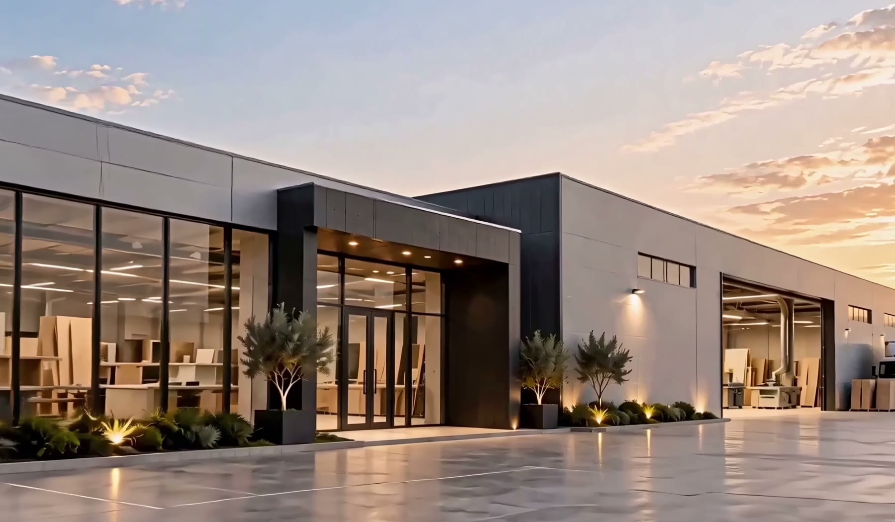

# S.F&S Group — İstehsala yaxından baxış

S.F&S Group üçün hazırlanmış, sürüşdürmə ilə idarə olunan film və həmin filmdən seçilmiş kadrlarla qurulmuş birsəhifəlik təqdimat.



[Yayımlanmış sayt](https://sfs-considered-living-0924.anarorujov.chatgpt.site/) · Hazırkı saytın giriş icazəsi sahib hesabı ilə məhdudlaşdırılıb.

## Yerli işə salma

Node.js 18 və ya daha yeni versiya tələb olunur. Əlavə paket quraşdırmağa ehtiyac yoxdur.

```bash
npm run dev
```

Brauzerdə `http://localhost:5179/` ünvanını açın.

## Layihə

- `index.html` — Azərbaycan dilində səhifə strukturu və mətnlər.
- `src/style.css` — uyğunlaşan görünüş və hərəkət üslubları.
- `src/main.js` — filmin sürüşdürmə mövqeyinə uyğun kadrını göstərir, qalereyanı və müraciət formasını idarə edir.
- `media/tour-desktop-0927.mp4` — 1920 × 1080, 24 fps film.
- `media/tour-mobile-0927.mp4` — telefonlar üçün 720 × 1280, 24 fps film.
- `media/tour-poster-*.jpg` — film açılana qədər və azaldılmış hərəkət rejimində görünən kadrlar.
- `media/film-*.jpg` — eyni filmdən götürülmüş qalereya və bölmə şəkilləri.
- `server.mjs` — yerli önizləmə serveri.

Mənbə kimi təqdim edilmiş `0927.mov` faylı repoya daxil deyil; saytda işlədilən optimallaşdırılmış videolar və bütün lazım olan şəkillər daxildir. Film avtomatik oynadılmır: səhifədəki sürüşdürmə mövqeyi video vaxtını müəyyən edir. Statik hostda aralıq bayt sorğularından asılı qalmamaq üçün seçilmiş kiçik video tam yüklənir və brauzerdə yerli media ünvanından oxunur.

Əlaqə ünvanı hələ təqdim edilməyib. Müraciət forması göndəriş yerinə kopyalana bilən mətn hazırlayır.
